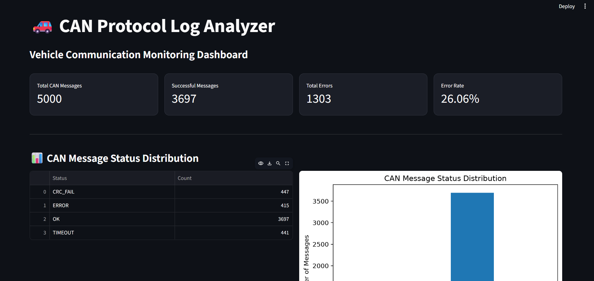
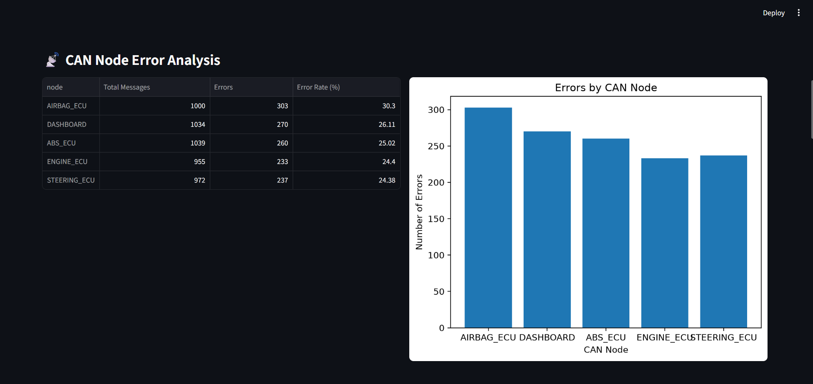
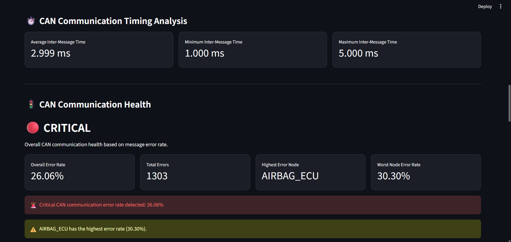

# 🚗 CAN Protocol Log Analyzer

A Python-based **CAN (Controller Area Network) Protocol Log Analyzer** designed to analyze, visualize, and monitor vehicle communication logs.

The application processes CAN communication data, identifies communication errors, analyzes ECU-level health, evaluates message timing, and provides an interactive **Streamlit monitoring dashboard** backed by a **FastAPI REST API**.

---

## 📌 Overview

Modern vehicles rely heavily on CAN communication for exchanging information between Electronic Control Units (ECUs).

This project provides a software-based solution for analyzing CAN logs and identifying communication issues such as:

- CRC failures
- Communication errors
- Message timeouts
- ECU-level error rates
- Abnormal communication timing
- High-error CAN nodes

The system converts raw CAN log data into meaningful analytics and presents the results through an interactive dashboard.

---

## ✨ Key Features

### 📊 CAN Message Analysis
- Analyze thousands of CAN communication messages.
- Categorize messages based on communication status.
- Calculate successful and failed message counts.
- Determine overall communication error rate.

### 🚨 Error Analysis
Supports analysis of:

- `CRC_FAIL`
- `ERROR`
- `TIMEOUT`
- Successful `OK` messages

The dashboard provides detailed information about affected nodes, message IDs, timestamps, direction, status, and payload.

### 🖥️ ECU / CAN Node Analysis

The system analyzes communication performance across different CAN nodes, including:

- `AIRBAG_ECU`
- `ABS_ECU`
- `ENGINE_ECU`
- `STEERING_ECU`
- `DASHBOARD`

It calculates:

- Total messages
- Number of errors
- Error rate per node
- Highest-error ECU

### ⏱️ Communication Timing Analysis

The analyzer evaluates inter-message communication timing and reports:

- Average inter-message time
- Minimum inter-message time
- Maximum inter-message time

This can help identify abnormal communication patterns and timing inconsistencies.

### 🔎 Interactive CAN Log Explorer

Users can filter and explore CAN messages based on:

- CAN node
- Message status
- Number of messages to display

The explorer provides detailed message information including:

- Timestamp
- CAN node
- Message ID
- TX/RX direction
- Message status
- Payload

### 📈 Data Visualization

The dashboard provides visual representations of CAN communication data, including:

- CAN message status distribution
- Errors by CAN node
- ECU error rates
- Communication health indicators

### 🔌 REST API

The project includes a **FastAPI backend** that exposes CAN analysis results through REST endpoints.

The dashboard communicates with the backend and displays the returned analytical results.

---
## 📸 Dashboard Preview

### Main Dashboard


### CAN Node Error Analysis


### CAN Communication Timing Analysis


### CAN Log Explorer


### CAN Error Investigation


## 🏗️ System Architecture

```text
                CAN Log Dataset
                       │
                       ▼
              ┌──────────────────┐
              │  Data Processing │
              │   & Database     │
              └────────┬─────────┘
                       │
                       ▼
              ┌──────────────────┐
              │  CAN Log Analyzer│
              │    & Analytics   │
              └────────┬─────────┘
                       │
            ┌──────────┴──────────┐
            ▼                     ▼
     ┌─────────────┐       ┌─────────────┐
     │   FastAPI   │       │ Visualization│
     │     API     │       │   Module     │
     └──────┬──────┘       └──────┬──────┘
            │                     │
            └──────────┬──────────┘
                       ▼
              ┌──────────────────┐
              │    Streamlit     │
              │    Dashboard     │
              └──────────────────┘
                       │
                       ▼
              Vehicle Communication
                 Monitoring & Analysis